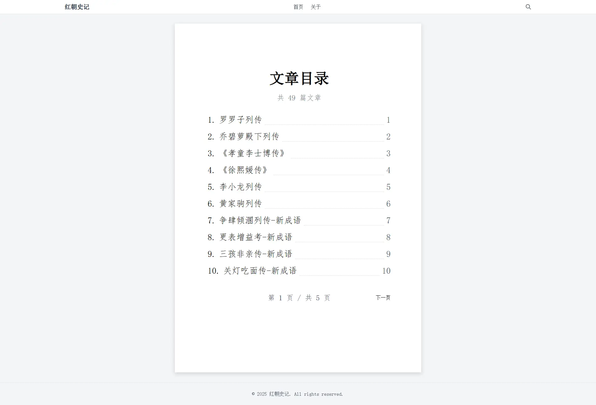

# Halo 2.0 Word Theme

一个模拟 Microsoft Word 文档风格的 Halo 2.0 主题，提供简洁、专业的阅读体验。

## 特性

- 模拟 Microsoft Word 文档风格，提供熟悉的阅读体验
- 响应式设计，适配桌面端和移动端
- 支持 Halo 2.0 的所有基本功能
- 支持 PluginSearchWidget 插件的搜索功能
- 使用 [Tailwind CSS](https://tailwindcss.com/) 进行样式开发
- 使用 [Vite](https://vitejs.dev/) 进行静态资源构建
- 集成了 [Alpine.js](https://alpinejs.dev/) 提供交互功能

## 预览



## 安装

### 方法一：从 GitHub 下载

1. 从 GitHub Releases 页面下载最新版本的主题包
2. 在 Halo 管理后台 -> 外观 -> 主题 中上传并启用主题

### 方法二：从主题商店安装

1. 在 Halo 管理后台 -> 外观 -> 主题商店 中搜索 "Word"
2. 点击安装并启用主题

## 配置

主题提供以下配置选项：

- **基本设置**：设置网站标题、Logo、备案信息等
- **样式设置**：自定义主题颜色、字体大小等
- **布局设置**：调整页面布局、侧边栏等

## 开发

```bash
# 克隆仓库
git clone https://github.com/cklx0719/theme-word.git

# 进入目录
cd theme-word

# 安装依赖
pnpm install

# 开发模式
pnpm dev
```

## 构建

```bash
pnpm build
```

## 许可证

本主题采用 MIT 许可证开源，详见 [LICENSE](./LICENSE) 文件。
